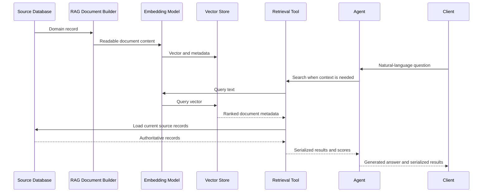

# RAG Patterns For PHP Backends

## Purpose

Retrieval-augmented generation, or RAG, gives an AI system relevant domain context at
request time. It retrieves likely useful records before an agent produces an answer.

RAG does not replace relational data. It makes domain information discoverable by
meaning while SQL remains responsible for validation, writes, relationships, and
current state.

## The RAG Lifecycle

A reusable RAG backend has four stages: document construction, index synchronization,
retrieval, and agent response.



## Source Of Truth

The vector store is an index, not an authority. It stores vectors, source keys, and
metadata needed to find candidate records.

After retrieval, the backend reloads current records from SQL using returned metadata
IDs. This prevents an agent from returning stale vector payload after a source record
changes or is deleted.

## Documents And Metadata

A document builder translates one domain record into content and metadata.

Content is readable text for semantic matching. Metadata is scalar data for identity,
routing, source-record reload, and potential future filtering.

```php
$document = new Document('A vehicle is electric and has 150 hp.');
$document->addMetadata('source_id', 42);
$document->addMetadata('fuel', 'electric');
$document->addMetadata('hp', 150);
```

Do not add private information merely because it is available in the source model.
Document content and metadata should contain only what retrieval requires.

## Synchronizing The Index

Source writes and vector writes are separate operations. Use after-commit observers
and queued jobs to synchronize vectors only after a source transaction succeeds.

```text
Source transaction commits
  -> observer queues synchronization
  -> job builds document and embedding
  -> job upserts or deletes the vector
```

This makes the vector index eventually consistent. Transient embedding or vector-store
failures can retry without rolling back the source transaction.

When a shared source record affects many documents, its change must fan out. A shared
specification change may therefore queue updates for every dependent document.

## Semantic Search

Semantic search is enough for a basic RAG agent. A query such as “quiet city car” can
retrieve relevant records even when the stored text does not contain those words.

Current vehicle retrieval uses semantic search only. Semantic search can retrieve
relevant records from a query such as “quiet city car,” but it cannot guarantee every
result satisfies an exact requirement.

Exact metadata filters are a future optional capability, not current behavior. They
could later provide deterministic constraints such as `fuel = electric` or `hp >= 120`
without changing embeddings when the required metadata is already present.

## Tools And Agents

The retrieval tool owns query embedding, vector search, source-record reload, and
safe result mapping. An agent should receive the tool, not direct database or vector
store access.

The agent decides whether to search and explains the returned results. The application
owns the response contract, so a frontend never needs to parse generated prose.

```json
{
  "response": {
    "natural-lang": "I found two matching records.",
    "serialized": [
      { "record": { "type": "example" }, "score": 0.91 }
    ]
  }
}
```

`natural-lang` is generated by the agent. `serialized` comes from a resource mapper
and is safe for machine consumers, including HTTP clients and frontends.

## Vehicle Example

This project applies the pattern to vehicles.

```text
Vehicle + VehicleDetails
  -> VehicleRagDocument
  -> Ollama embedding
  -> Qdrant vehicle-documents collection
  -> VehicleSearchTool
  -> VehicleAgent
```

`VehicleSearchTool` supports a required semantic query and an optional result limit.
Exact vehicle filters are a future optional capability.

`VehicleAgent` uses local `qwen3:8b` for generation. Ollama `nomic-embed-text` is
used separately for embeddings.

## Add A New Entity

To apply this pattern to a new entity such as `Fix`:

1. Create the source model, migration, factory, and source-record tests.
2. Create a document builder with readable content and scalar metadata.
3. Opt the model into document synchronization and declare its vector collection.
4. Add observers for the model and dependent shared records.
5. Create a safe result resource for agent and frontend output.
6. Create a model-specific semantic retrieval tool; add exact filters only when that
   future capability is required.
7. Create an agent with only that model's read-only retrieval tool.
8. Test indexing, semantic retrieval, resource mapping, and agent output.

Each entity can use an independent collection. Generic synchronization, retrieval,
and resource infrastructure remain shared.

## Local Runtime

Qdrant runs through DDEV. Ollama runs on the macOS host and is available to the DDEV
web container at `http://host.docker.internal:11434/api`.

```bash
ddev start
ddev php artisan queue:work
ddev php artisan test
```

Open Qdrant at `http://localhost:6333/dashboard`.

## History And Decisions

See `docs/history/2026-07-18-rag-foundation.md` for the original session summary.
Architecture decisions are recorded under `docs/adr/` and detailed designs under
`docs/superpowers/`.
