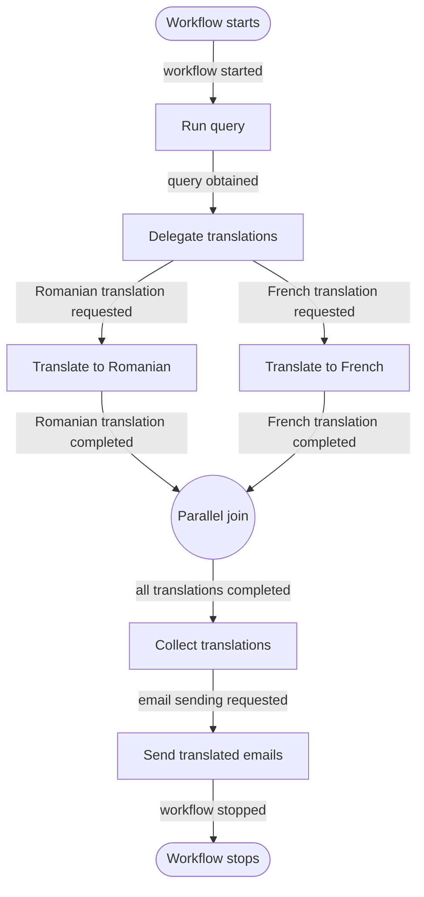

# README Workflows Implementation Plan

> **For agentic workers:** REQUIRED SUB-SKILL: Use superpowers:subagent-driven-development (recommended) or superpowers:executing-plans to implement this plan task-by-task. Steps use checkbox (`- [ ]`) syntax for tracking.

**Goal:** Explain Neuron workflow concepts in the README and illustrate the implemented multilingual email workflow with friendly event labels on every diagram arrow.

**Architecture:** Add one self-contained documentation section after the vehicle example, where readers already know the agent used by the workflow. Introduce nodes, events, state, and parallel branches before an inline Mermaid flowchart that mirrors `EmailQueryWorkflow` and its node event contracts.

**Tech Stack:** Markdown, Mermaid, Neuron AI workflow concepts

---

## File Structure

- Modify: `README.md` to add the workflow concept explanation and implemented workflow diagram.

### Task 1: Document Workflows and the Email Query Flow

**Files:**
- Modify: `README.md:141`

- [ ] **Step 1: Add the workflow concept and implementation section**

Insert the following section between `Vehicle Example` and `Add A New Entity`:

````markdown
## Workflows

Neuron workflows model multi-step operations as an event-driven graph. Each node
performs one unit of work and emits an event that routes execution to the next node.
Workflow state retains data needed by later nodes, while a parallel event can run
isolated branches concurrently and join their results before execution continues.

`EmailQueryWorkflow` applies these concepts to multilingual vehicle-query emails. It
stores the complete `VehicleAgent` response in workflow state, translates only its
natural-language text in Romanian and French branches, collects both results, and sends
one email per translation. Serialized vehicle records remain unchanged and are included
with each email.



The translation nodes run concurrently through Neuron's asynchronous executor. The
collector runs only after both branches complete and stores translations by language in
the main workflow state.
````

- [ ] **Step 2: Check the Markdown diff for syntax and scope**

Run:

```bash
git diff --check -- README.md
git diff -- README.md
```

Expected: `git diff --check` exits with no output. The README diff contains only the new
`Workflows` section, and every Mermaid edge uses `-->|event label|` syntax.

- [ ] **Step 3: Compare the diagram with the implementation**

Check these contracts directly:

```text
RunQueryNode: StartEvent -> QueryObtainedEvent
DelegatorNode: QueryObtainedEvent -> parallel Romanian/French request events
RomanianTranslationNode: Romanian request -> Romanian completion
FrenchTranslationNode: French request -> French completion
CollectorNode: completed ParallelEvent -> email-send request
EmailSenderNode: email-send request -> StopEvent
```

Expected: the README has one node for each implemented node, preserves the parallel
fan-out and join, and uses a friendly label for every corresponding event transition,
including delivery of the completed parallel results to the collector.

- [ ] **Step 4: Commit the README update**

```bash
git add README.md
git commit -m "docs: explain email query workflow"
```
